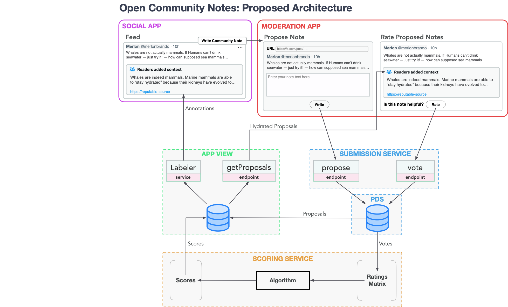

# Open Community Notes

**Version:** 0.1.1 (Draft)  
**Status:** Proposal

This repository contains draft specifications for an open, interoperable Community Notes protocol.

The goal is to define a shared data model and service interfaces for proposing, rating, scoring, and serving community-authored annotations about online content. The protocol is intended to support Community Notes–style systems across multiple social networks and applications, while allowing different services to experiment with scoring, trust, and anti-abuse mechanisms.

At a high level, the proposal separates:

- **Public record storage** for note proposals and ratings
- **Submission services** that accept contributions and apply eligibility, anti-abuse, and privacy controls
- **Scoring services** that compute note scores or publication decisions
- **Aggregations** that serve hydrated proposals and published annotations to applications

This repository is an early draft. It does **not** yet define every aspect of a complete production-ready protocol. In particular, privacy, contributor eligibility, anti-manipulation protections, and some annotation-serving details remain active design areas.

## Quick Links

- [Overview](#overview)
- [Architecture](#architecture)
- [Design Features](#design-features)
- [Lexicon](#lexicon)
- [Architecture Challenges](#architecture-challenges)
- [How to Contribute](#how-to-contribute)

## Overview

The proposal aims to support a Community Notes system that is:

1. **Open with credible exit.**  
   Note proposals and ratings live in an open network rather than inside a closed platform database. This allows anyone to inspect the underlying records, verify a service’s published outputs, or build alternative services on top of the same public data.

2. **Cross-protocol.**  
   The protocol is designed to support annotations on any content that can be identified by a URI, including posts on social networks like ActivityPub.

3. **General Peer Moderation.**  
   The same protocol can support broader community moderation workflows. A “note” is one kind of community-authored annotation; the same structure can also support labels or moderation actions.

The proposal is inspired by Community Notes as deployed on X, but it is not limited to reproducing X’s exact system. Different services may adopt different scoring algorithms, trust models, contributor policies, and moderation policies while still interoperating at the record and interface layer.

## What This Proposal Standardizes

This proposal is intended to standardize:

- The record types used for note proposals, ratings, and related moderation data
- The interface between submission services, scoring services, API servers, and applications
- The representation of published annotations and related moderation outputs
- The use of an open network as the underlying persistence layer

This proposal does **not** require all services to use the same:

- scoring algorithm
- contributor onboarding policy
- anti-abuse mechanism
- privacy mechanism

Those choices are intentionally left open, provided that services remain compatible with the shared record and interface layer.

## AT Protocol as the Initial Data Layer

This draft uses [AT Protocol](https://en.wikipedia.org/wiki/AT_Protocol) as its initial underlying data layer.

Using a custom lexicon, Open Community Notes stores note proposals and ratings as AT Protocol records. In the current design, those records are written to the PDS of a service account associated with a submission service.

## Architecture

### Roles

- **Social Apps**  
  Display published annotations and moderation labels alongside content.

- **Moderation Apps**  
  Provide interfaces for proposing notes and rating proposed notes.

- **Submission Services**  
  Accept proposal and vote submissions, enforce eligibility and anti-abuse controls, and may pseudonymize submitted records before writing them to the open data layer.

- **Scoring Services**  
  Read proposals and votes from the open data layer, run scoring algorithms, and produce scores or publication decisions.

- **Notes API Servers**  
  Serve hydrated proposals and published annotations to apps through query endpoints and labeler or annotation APIs.

## Design Features

**Open Records**  
Note proposals and ratings are stored as public records, enabling independent inspection and verification.

**Algorithm Freedom**  
Services may use X’s open-source Community Notes scoring algorithm, variations of it, or entirely different scoring approaches.

**Independent Verification**  
Because the underlying proposal and rating records are public, anyone can verify a service’s outputs or run alternative analyses over the same data.

**Interoperable Moderation Inputs**  
Moderation tools are independent of scoring services. Multiple moderation apps can produce proposals and votes that can be consumed by one or more scoring services.

**Generalized Moderation**  
The protocol is not limited to explanatory notes. It can support broader community moderation actions, labels, and annotations.

**Cross-Protocol Scope**  
Although this draft uses AT Protocol as its initial data layer, the target use case is broader: community-authored annotations for any URI-addressable content.

## Lexicon

Open Community Notes builds on the [PMsky](https://pmsky.social/) [custom lexicon](https://docs.pmsky.social/tech/lexicon), which was designed for generalized community moderation. See the [Lexicon specification](/002-lexicon#readme).

## Architecture Challenges

The main architectural challenge is to combine **open records and interoperable interfaces** with properties that Community Notes systems usually rely on in more centralized deployments, especially privacy, abuse resistance, and strong incentives for honest participation.

### Annotations

A Community Note can be understood as a type of **annotation**: information attached to a record by someone other than the record creator, and potentially displayed alongside that record.

This proposal assumes that a more general AT Protocol annotation mechanism will eventually exist. A draft spec for using labelers as annotators is proposed [here](/005-annotations). Whatever mechanism is adopted by the ATProto community, this draft should align with it.

In the meantime, helpful community notes can be published as labels, while applications make an additional call to a Notes API server to fetch note content and related metadata. See [Labeling Architecture](/004-labeling).

### Privacy and Pseudonymity

Community Notes systems benefit from some degree of contributor privacy. Publicly linking every note and rating to a contributor’s primary social identity can increase retaliation, social pressure, and strategic behavior.

A common approach is to allow contributors to act through stable pseudonymous identifiers rather than through their public account identity. In this model, a submission service manages the mapping between user identities and pseudonymous contributor identifiers, while only the pseudonymous identifiers appear in public note and rating records.

**Tradeoffs include:**

- contributors may need to trust the service operator not to expose identity mappings
- identity mappings become sensitive infrastructure and high-value targets
- stronger privacy can make abuse investigation more difficult
- weaker privacy can discourage honest participation or make coordinated retaliation easier

Different services may choose different points in this design space.

See the [Anonymous IDs proposal](/003-aids#readme).

### Manipulation Resistance and Bots

No scoring algorithm is fully manipulation-proof. Community Notes systems can be resistant to some forms of coordinated behavior, but sufficiently large or well-resourced attacks can still distort outcomes.

For that reason, abuse resistance cannot be treated as purely an algorithmic problem. Submission services may need to combine scoring with contribution controls and operational defenses.

Possible defense mechanisms include:

- contributor eligibility requirements such as phone or email verification
- proof-of-work or similar cost imposition for new contributors
- delayed publication of ratings to make coordination and copying harder
- reputation or rating-impact systems that limit the influence of new or low-quality contributors
- staged rollout to a smaller, trusted, and diverse initial contributor base

These mechanisms are service-dependent and may vary substantially across deployments.

### Adoption and Network Effects

Community Notes systems become more valuable as they gain more contributors, broader content coverage, and wider display across applications.

This creates several bootstrapping challenges:

- **cold start:** a new system may have too few contributors or ratings to produce useful outputs
- **display adoption:** platforms may hesitate to integrate a system before it demonstrates value
- **contributor incentives:** people need reasons to contribute high-quality notes and ratings, especially early on

Possible mitigation strategies include starting with a focused community, targeting integrations where community moderation is already valued, and making integration simple enough that experimenting with the protocol is low-cost.

### Credible Exit and Trust

A central design goal of this proposal is **credible exit**: continued operation of the protocol even if a particular service becomes unavailable or untrusted.

Different service roles provide different degrees of replaceability and verifiability.

**Notes API Servers** 
Notes API Servers, including labelers, serve derived outputs based on data from submission and scoring services. Although users and apps must trust them, their outputs are publicly inspectable and can be recomputed by others, so they are relatively easy to replace.

**Scoring Services**  
Scoring services compute scores or publication decisions from publicly available proposal and rating data. Their outputs are verifiable: other parties can inspect the inputs and rerun the scoring logic.

**Submission Services**  
Submission services require the most trust. They control contribution intake, eligibility checks, anti-abuse measures, and pseudonymous identity assignment. Some aspects of their behavior are externally visible, but others are difficult or impossible to verify from public records alone. For example, outsiders cannot fully verify that a submission service is enforcing its stated anti-manipulation policies, nor can they rule out the possibility that the service itself is generating fraudulent submissions.

If a submission service goes offline, its publicly stored proposals and ratings remain available for inspection, analysis, and reuse. However, contributors may not be able to carry their pseudonymous identity, reputation, or service-specific privileges to a successor service.

## How to Contribute

Contributions and criticism are welcome.

You can help by:

- opening issues to discuss architecture, terminology, or tradeoffs
- submitting pull requests with edits or clarifications
- contributing alternative designs, implementation notes, or threat-model analysis

## License

All content in this repository is licensed under the [MIT License](LICENSE).

