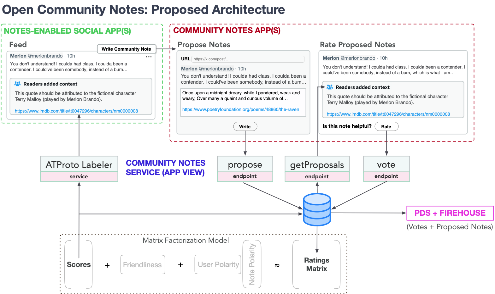

# The Open Community Notes Standard

**Version:** 0.1.0 (Draft)  
**Status:** Proposal

This repository contains proposals and specifications for an open, interoperable Community Notes standard. The standard defines interfaces and data structures for collaborative content annotation and moderation that can work across social networks and platforms.

## Quick Links

- [Overview](#overview)
- [Glossary](#glossary)
- [Architecture](#high-level-architecture)
- [Challenges](#challenges)
- [How to Contribute](#how-to-contribute)

## How to Contribute

Your involvement is highly encouraged! Feel free to:

- Open an issue to discuss suggestions, concerns, or ideas.
- Submit pull requests with improvements, edits, or clarifications.
- Share feedback or engage in ongoing discussions via issues or discussions.

## License

All content in this repository is licensed under the [MIT License](LICENSE), encouraging widespread collaboration and adoption. Contributors agree that their contributions may be incorporated under this license.

# Overview 

The vision is a version of X's Community Notes that:

1. Is [**open with credible exit**](https://perma.cc/LC9R-Q6JY). Although Community Notes requires some [*architectural centralization*](https://medium.com/@VitalikButerin/the-meaning-of-decentralization-a0c92b76a274)—some entity must run the Community Notes algorithm on the full dataset—all notes and ratings can live in an open network. This enables anyone to independently verify the algorithm’s output or run their own service.

2. Could be used by any social network—from federated networks like AT Protocol and ActivityPub, to TikTok and even X itself.

3. Can be used as a general standard for community moderation.

Implementing features like **anonymity, bots protection, and manipulation resistance** in an open, federated standard presents unique challenges compared to centralized systems. See the [Challenges](#challenges) section below for discussion of these issues.

### Based on ATProto

The Open Community Notes standard is build on [AT Protocol](https://en.wikipedia.org/wiki/AT_Protocol). Using a custom lexicon, Open Community Notes leverages AT Protocol as an open, federated **data store for notes and ratings**. 

Note and rating records are stored in the PDS of a service account associated with each Community Notes Service, ensuring data persistence and independent verifiability.

### Beyond ATProto

While using ATProto as a data layer, the standard is designed to be platform-agnostic in principle. The Community Notes Service can accept and serve notes for **any content identifiable by a URI** (such as a Tweet, Mastodon post, TikTok video, or web page). 

### Generalized Moderation

The standard's scope extends beyond community notes. Services can use the same algorithms for making decisions about *any* moderation label (e.g., `scam`, `harassment`, `misinformation`). A note is just an explanation of the reason for a label.

Open Community Notes builds off of the [PMsky](https://pmsky.social/) [custom lexicon](https://docs.pmsky.social/tech/lexicon), which was desiged for generalized community moderation. 

## High-Level Architecture

The architecture follows ATProto's **stackable moderation** approach: multiple Community Notes Services can coexist, each implementing their own algorithms and policies. Users and apps choose which services to use.

### **Community Notes App(s)**

User-facing interfaces that allow contributors to:
- Propose new notes on content
- Browse notes that need ratings
- Rate existing notes as helpful or unhelpful
- View their contributor rating impact score (if the service provides this)

These apps interface with one or more Community Notes Services to submit notes and ratings, and retrieve helpful notes.

### **Community Notes Service**

Each service is an independent operator that:
- Provides API endpoints for proposing notes and submitting ratings
- Manages **Anonymous IDs (AIDs)** that keep the link between contributors' public profiles and their note/rating activity private (see [Anonymous IDs proposal](/003-aids#readme))
- Stores note and rating records as ATProto records in the PDS of its service account
- Runs a ranking algorithm (e.g., X's bridging-based algorithm, or alternatives) to determine which notes are helpful
- Implements the ATProto Labeler API to publish community notes as labels (see [Labeling Architecture](/004-labeling#readme))
- Enforces access controls, rate limits, and quality standards

**Algorithm Freedom:** The standard does not mandate a specific ranking algorithm. Services may use X's open-source Community Notes algorithm, implement variations, or create entirely different approaches. This allows for experimentation and evolution.

**Independent Verification:** Since note and rating records are public ATProto records, anyone can verify a service's outputs or run alternative analyses on the same data.

### **Integrated Social Apps**

Social media applications (Bluesky, Mastodon, etc.) that:
- Subscribe to one or more Community Notes labeling services
- Display helpful community notes beneath relevant posts
- Show "Rate this note" prompts for posts with proposed notes needing ratings
- Optionally integrate note writing/rating directly in their UI, or link to a Community Notes App

Apps can choose which services to trust and display, giving users control over their moderation experience.

## Implementation Details

### Labels with Notes

Technically, a Community Note is an ATProto `annotation` label with an associated `note` field containing the explanatory text. When Community Notes-enabled apps see an `annotation` label on a post, they display it as a community note.

For proposed notes that haven't yet been rated as helpful or unhelpful, the system uses a `proposed-annotation` label. Apps can display "Rate this note" prompts for posts with this label, similar to how X's Community Notes works.

See the proposed [Labeling Architecture](/004-labeling#readme) for detailed specifications.

### Extending to Other Label Types

Any label type can optionally include an associated note. For example:
- A `scam` label might include a note explaining why the content is deceptive
- A `harassment` label might include context about why the content violates policies
- A `misinformation` label might include fact-checking information and sources

This allows the standard to support a wide range of community-driven moderation use cases beyond simple annotations.

## Challenges

### Anonymity

X's Community Notes preserves contributor anonymity to prevent retaliation and gaming. Each contributor receives an Anonymous ID (AID), and while their notes and ratings are publicly visible, X doesn't publish information linking AIDs to X handles.

**Approach:** Each Community Notes Service manages AIDs and keeps the mapping between AIDs and users' public accounts confidential. See the [Anonymous IDs proposal](/003-aids#readme) for detailed specification of approaches including blind signatures, zero-knowledge proofs, and trusted hardware.

**Tradeoffs:**
- Contributors must trust the service operator to protect the AID-to-identity mapping
- The AID mapping is a high-value target for attackers; requires strong security practices
- Anonymity must be balanced with legal requirements (e.g., DMCA, illegal content)
- Perfect anonymity may enable abuse; accountability may discourage honest participation

Services can implement different points on this tradeoff spectrum based on their policies and user base.

### Manipulation and Bots

Ranking algorithms (such as the bridging-based algorithm used by X) can have inherent resistance to coordinated manipulation. However, no algorithm is manipulation-proof—a sufficiently large coordinated attack with many bot accounts can overwhelm any system.

**Potential Defense Strategies (Service-Dependent):**

Services can implement various combinations of defenses:

**1. Proof of Personhood**
- Telephone number requirements (as X uses)
- Email verification
- **Alternative: Proof of Work** for new contributors (see [Anubis](https://anubis.techaro.lol)) - legitimate users complete trivial computation; Sybil attacks become expensive

**2. Delayed Publishing**
- Delaying publication of ratings prevents copying behavior and makes coordination harder

**3. Rating Impact / Reputation Scores**
- Contributors earn reputation based on rating quality
- New contributors must build reputation before gaining full privileges
- Attackers must spend time and effort building reputation

**4. Trusted Core Contributors**
- X Community Notes began with a carefully selected group of diverse, good-faith early adopters who established norms
- Controlled rollout allows community culture to form before facing widespread manipulation attempts

### Adoption and Network Effects

The value of community notes increases with:
- **Number of contributors:** More contributors means faster coverage of noteworthy content
- **Quality and diversity of contributors:** Cross-ideological agreement requires diverse perspectives
- **Platform integration:** More platforms displaying notes increases incentive to contribute

**Challenges:**
- **Cold start problem:** Initially, few notes will be rated, making the service less useful
- **Platform adoption:** Convincing platforms to integrate requires demonstrating value
- **Contributor incentives:** What motivates people to participate, especially early on?

**Mitigation strategies:**
- Start with a focused community (e.g., Bluesky users) where trust and shared norms exist
- Partner with platforms that already value community moderation
- Consider future incentive mechanisms (reputation, governance rights, etc.)
- Make the standard so easy to integrate that the cost of trying it is minimal

### Data Storage Credible Exit

**Where is data stored?**
- Note and rating records are stored as ATProto records in the PDS of each service's service account
- These records are publicly accessible ATProto records, enabling transparency and independent verification
- The AID-to-identity mapping is kept private by the service

**What happens if a service goes offline?**
- Notes and ratings persist in ATProto data repositories (PDSs) even if the service operator stops running
- Since records are public, anyone can retrieve the data and verify outputs
- Alternative services can emerge using different algorithms on the same or new datasets
- Apps can switch to alternative services
