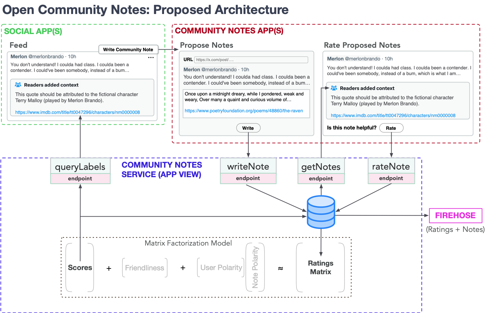

# Proposal: An Open Community Notes Protocol

This document proposes a high-level architecture for an Open Community Notes Protocol.

The vision is a version of X's Community Notes that:

1. Is [**open with credible exit**](https://perma.cc/LC9R-Q6JY). Although Community Notes requires some [*architectural centralization*](https://medium.com/@VitalikButerin/the-meaning-of-decentralization-a0c92b76a274)—some entity must run the Community Notes algorithm on the full dataset—all notes and ratings can live in an open network. This enables anyone to independently verify the algorithm’s output or run their own service.

2. Could be used by any social network—from federated networks like AT Protocol and ActivityPub, to TikTok and even X itself.

3. Can be used as a general protocol for community moderation.

We propose closely mirroring X's Community Notes implementation, using their open-source algorithm and a similar interface design. We'll also adopt their solutions for handling **anonymity, bots, and manipulation**, though implementing these features in an open protocol presents unique challenges. See the [Challenges](#challenges) section below for our proposed solutions.

## High Level Proposal

### Based on AT Protocol

We propose building the Open Community Notes protocol on top of [AT Protocol](https://en.wikipedia.org/wiki/AT_Protocol). AT Protocol supports different [**social modes**](https://bsky.social/about/bluesky-and-the-at-protocol-usable-decentralized-social-media-martin-kleppmann.pdf), beyond just the microblogging mode used by the Bluesky app. By defining a new AT Protocol [Custom Schema](https://docs.bsky.app/docs/advanced-guides/custom-schemas), Open Community Notes can use AT Protocol as an open **store for notes and ratings**. Community Notes **apps** would allow users to browse, propose, and rate notes. And an independent Community Notes **scoring service** and [**labeler**](https://atproto.com/specs/label) would be implemented as an [App View](https://docs.bsky.app/docs/advanced-guides/federation-architecture#app-views), allowing Bluesky and others to easily display helpful Community Notes in their apps.

### Multi-Platform

This Open Community Notes wouldn't be limited to Bluesky and other AT Protocol apps. While AT Protocol would serve as the data layer, a Community Notes App would let users submit, browse, and rate notes on **any content identifiable by a URI** (such as a Tweet). The feed of helpful Community Notes would be available as a **web service** that anyone can subscribe to.

### Generalized Moderation

A generalized community moderation protocol could use the same algorithm that Community Notes uses for identifying helpful *notes* for identifying helpful **labels with notes**. A classic Community Note would be a `annotation` label along with a note. But the algorithm could also be used for `harassment` or other labels, with optional notes explaining the reason for the label.

## High-Level Architecture

### **Community Notes App(s)**

A user interface for proposing notes, browsing notes that need ratings, and voting on notes. Interfaces with the Community Notes Service to submit notes and ratings, and with the Scoring Service to pull helpful notes and notes needing ratings.

### **Community Notes Service**

Provides API endpoints for reading and writing notes and ratings. Publishes signed note and ratings records using an **Anonymous IDs** kept separate from users' public profiles. See [Anonymous IDs](#anonymous-ids) below.

Also serves as a **labeler**, publishing community notes labels, with the helpful note included in the label.

### **Community Notes Aggregator**

Runs the Community Notes algorithm to score notes and produce rater impact scores.

### Integrated Social Apps

Apps like Bluesky can use display notes under posts that have a community notes label. Since the labeler is a web services, even non-AT Protocol apps like Mastodon can integrate them.

Apps can either build Community Notes features directly into their interface or direct users to an external app for writing and rating notes.

## Generalized Bridging-Based Moderation

Community Notes allows members of the community to add context to posts. However, the same [bridging-based ranking algorithm](https://jonathanwarden.com/understanding-community-notes/) used to identify helpful notes could be used to identify [*any*](https://github.com/bluesky-social/social-app/issues/5783#issuecomment-2495557772) moderation label (scam, harassment, etc.). Further, any label could be associated with additional [context](https://github.com/bluesky-social/social-app/issues/4003) (a reason for that label).

So, a generalized Community Notes protocol would be used to add labels to posts, along with notes/reasons for those labels.

### "Needs Context” Labels

AT Protocol [moderation services](https://docs.bsky.app/docs/advanced-guides/moderation) can currently be used to add `misinformation` labels to posts. But we suggest that a [more appropriate general label](https://github.com/bluesky-social/social-app/issues/5783#issuecomment-2547443254) for posts with helpful notes would be [`annotation`]([https://github.com/bluesky-social/social-app/issues/5783#issuecomment-2547443254]\(https://github.com/bluesky-social/social-app/issues/5783#issuecomment-2547443254\)).

### "Rate Proposed Community Notes" Labels

X's Community Notes also places a "Rate Proposed Community Notes" notice below posts that have notes that need ratings. A Community Notes Labeler could also publish `rate-proposed-community-notes` labels, and social apps could send user to the Community Notes UI when they click on these labels.

### Adding Reasons to Labels

A moderation service that publishes labels such as `scam` might sometimes want to include an explanation for why the post is a scam. So in general, a note can be considered as a *reason for a label.*

A [com.atproto.label](https://github.com/bluesky-social/atproto/tree/main/lexicons/com/atproto/label) can include additional metadata such as a note URI. So moderation services, including the Community Notes Scoring Service, could optionally publish notes with any label.

## Challenges

### Anonymity

X's Community Notes preserves anonymity of contributors. Each contributor receives an ID, and while their notes and ratings are public, X doesn't publish information linking these IDs to X handles. We propose that the Community Notes Service manage users’ anonymous IDs and keep the link between anonymous IDs and users' public accounts secret. There are various ways this can be done. See [Anonymous IDs below](#anonymous-ids).

### Manipulation

The Community Notes algorithm has some resistance to Sybil attacks and coordinated manipulation. However, it isn't manipulation-proof—too many bot accounts will break it.

X uses various methods of defending against manipulation.

**Proof of Personhood**

* X requires telephone numbers for signups, imposing a small cost that discourages bots. Community Notes Apps could require this, but it can't be enforced by the protocol.

* **Possible Alternative Solution: Proof of Work:** An alternative would be requiring a small *proof of work* from new contributors (see [Anubis](https://anubis.techaro.lol)). Regular users would complete this computation on their device at negligible cost, while Sybil attacks could become prohibitively expensive.

**Delayed Publishing**

* To prevent users from simply copying ratings from other users, X delays publishing user ratings. Community Notes PDSs could also impose a delay between the time they receive a rating through the note rating API endpoint and the time they write a record to the PDS.

**Trust and Rating Impact**

* Community Notes users on X earn a Rating Impact score based on how often their ratings help identify helpful or unhelpful notes. New contributors must achieve a minimum rating impact before they can write notes.

* This same requirement could be enforced independently by the scoring service, PDS, and UIs.

**Core Contributors**

* Community Notes at X began with a core group of committed early adopters who acted in good faith. By the time the system faced widespread attention and potential manipulation, the community had established clear unwritten norms about what makes a note helpful. The rating impact system required new contributors to adapt to these norms.

* Organizations building the first Open Community Notes apps could similarly implement a controlled rollout, seeking to attract a diverse foundation of trustworthy early users.

## Anonymous IDs

Note and rating records would include an additional **anonymous ID** field associated with the user ID. These IDs would be prefixed with a string identifying the PDS (e.g. "communitynotes.bsky.app:5684B38EB5…") to guarantee uniqueness. This prefix would be associated with the domain of the DID of the PDS that signs the transaction. This way the Community Notes PDS can prove its authority to sign transactions for its own anonymous IDs, preventing other PDSs from (maliciously) submitting ratings for X Community Notes users.

A more involved system could permit portability (e.g. allow X users to port their anonymous ID to a different Community Notes app). Future research could explore cryptographic solutions that enable users to switch between pseudonymous identity providers.

## Reporting Workflow

Currently, users of Bluesky and other apps can submit anonymous **moderation reports** to a moderation service. These reports can include a reason “e.g. misleading content or spam” and an optional detailed description. Each moderation service determines what to do with these reports.

If a Community Notes App implemented the moderation service [API for submitting reports](https://docs.bsky.app/docs/api/com-atproto-moderation-create-report), then these reports could be automatically converted into notes. However, it is likely that many moderation reports are low quality. Further, only users who have received a minimum rating impact score and have provided the required proof of work should be allowed to submit notes (see the Manipulation section above).

So instead, we suggest that a Community Notes App could use moderation reports to help users identify posts that may need notes.
